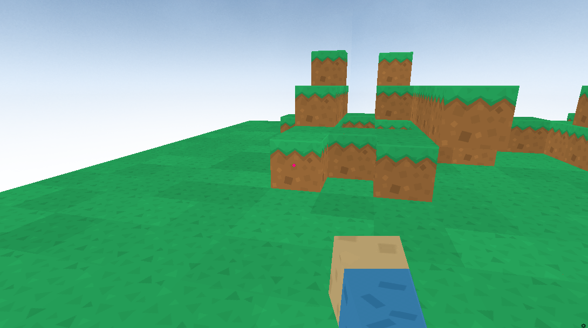
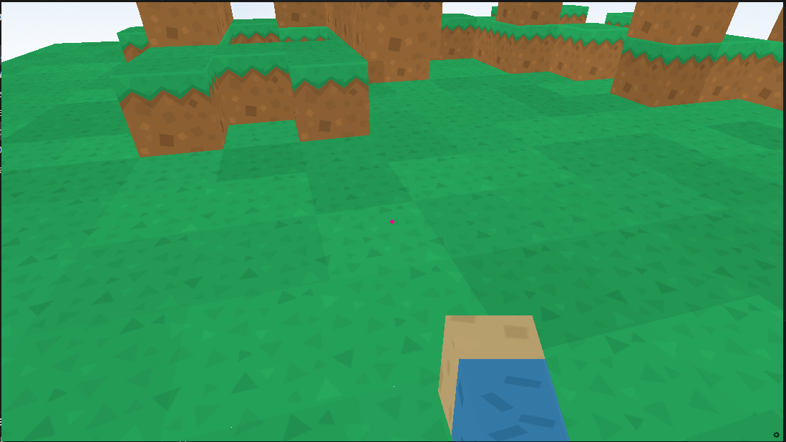

# creando juego basico de minicraft con python

## Clonar el repositorio
```bash
git clone git@github.com:emersonxinay/minicraft-python.git
``` 
```bash
cd minicraft-python
``` 
### ejecutar el programa 
```bash
python3 minicraft.py
```
## imagen del juego minicraft que deberia salir al correr el programa 

<br>


## Instrucciones para el juego:
``` 
para avanzar adelante, la tecla: W
```


```
para girar a la derecha, la tecla: D
``` 

``` 
Para girar a la izquierda, la tecla: A
``` 

```  
Para saltar, la tecla: barra espaciadora
``` 

``` 
Para construir bloques: solo click del maus
``` 


## para cerrar el juego, solo precionar "Esc"
```
Esc
``` 